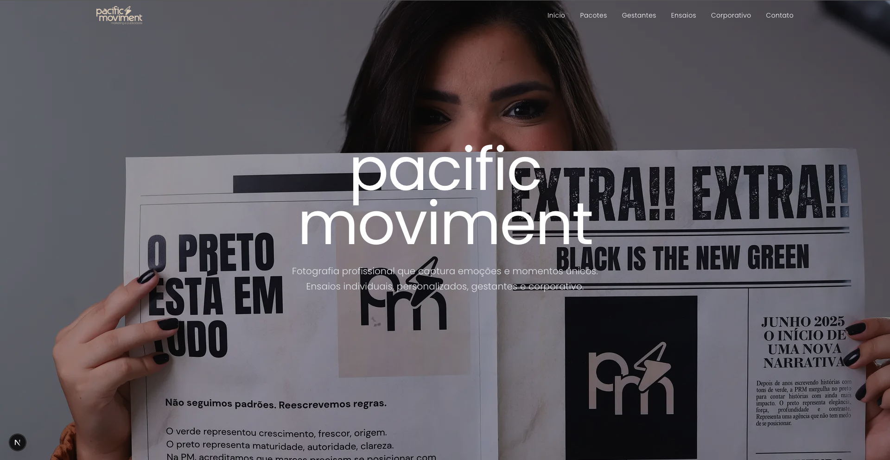

# Pacific Movement 📸

> Fotografia profissional que captura emoções e momentos únicos



## ✨ Sobre o Projeto

**Pacific Movement** é um estúdio de fotografia moderno especializado em ensaios únicos e personalizados. Nossa missão é transformar momentos especiais em arte através da fotografia profissional.

## 🎯 Serviços

- **📷 Ensaios Individuais** - Sessões personalizadas que destacam sua personalidade
- **🤰 Ensaios Gestantes** - Celebrando momentos únicos da maternidade  
- **👔 Fotografia Corporativa** - Imagem profissional para empresas e executivos
- **💼 Eventos Corporativos** - Cobertura completa de eventos empresariais
- **👨‍👩‍👧‍👦 Ensaios Familiares** - Momentos preciosos em família

## 💰 Pacotes

| Pacote | Duração | Fotos | Preço |
|--------|---------|-------|-------|
| **Opção 1** | 30 min | 10 fotos editadas | R$ 649,00 |
| **Opção 2** | 60 min | 15 fotos editadas | R$ 745,00 |
| **Opção 3** | 90 min | 20 fotos editadas | R$ 940,00 |

*Parcelamento em até 6x sem juros*

## 🚀 Tecnologias

Este site foi desenvolvido com as mais modernas tecnologias:

- **Next.js 15** - Framework React de última geração
- **TypeScript** - Tipagem estática para maior robustez
- **Tailwind CSS** - Design system responsivo e moderno
- **Framer Motion** - Animações fluidas e elegantes
- **Vercel** - Deploy otimizado e performático

### 🎨 Design Features

- ✅ **Header Transparente** com efeito de scroll
- ✅ **Hero Sections** em tela cheia com imagens de fundo
- ✅ **Tipografia Premium** (Poppins + Playfair Display)
- ✅ **Animações Suaves** em todos os elementos
- ✅ **Layout Responsivo** para todos os dispositivos
- ✅ **SEO Otimizado** com meta tags personalizadas

## 📍 Localização

**Endereço:** Av. C, 236A - Conjunto Ceará, Fortaleza - CE  
**CEP:** 60533-500

## 📞 Contato

- **WhatsApp:** [(85) 9273-3553](https://wa.me/558592733553)
- **Email:** agenciapacificmoviment@gmail.com
- **Instagram:** [@pacificmoviment](https://www.instagram.com/pacificmoviment)

## 📊 Estatísticas

- ✅ **500+** Ensaios Realizados
- ✅ **2000+** Fotos Editadas  
- ✅ **98%** Taxa de Satisfação
- ✅ **24h** Prazo de Seleção

## 🛠️ Como executar

```bash
# Clone o repositório
git clone https://github.com/SteveHerison/Pacific.git

# Entre no diretório
cd pacific-movement

# Instale as dependências
npm install

# Execute o projeto
npm run dev
```

Acesse [http://localhost:3000](http://localhost:3000) para ver o resultado.

## 📄 Licença

Este projeto está sob a licença MIT. Veja o arquivo [LICENSE](LICENSE) para mais detalhes.

---

<div align="center">
  
**🤖 Desenvolvido com [Claude Code](https://claude.ai/code)**

*Transformando momentos em memórias eternas* ✨

</div>